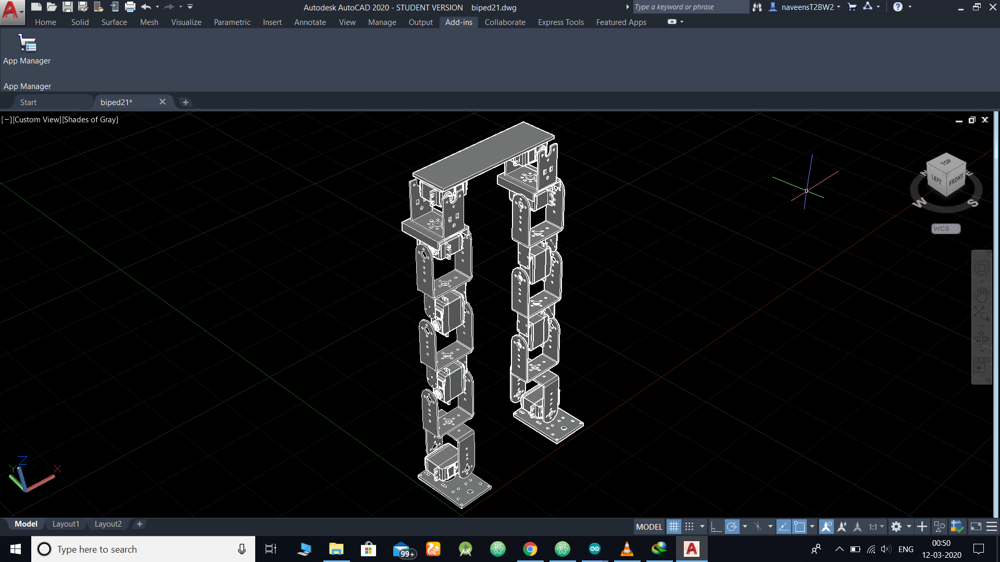

# Biped_Walking_bot
This is a two legged walking bot that simulates human walking 

<h2>
  Introduction
 </h2> 

 Bipedalism is a form of terrestrial locomotion where an organism moves by means of its two rear limbs or legs. An machine that usually moves in a bipedal manner is   known as a biped, meaning "two feet". Our project  BIPED has 10 Degree of Freedom is a bot designed to walk in flat surfaces. Theoretically biped refers to    walking , running , hopping. However due the complexity, we limited ourselves to walking.The project is divided into four  phases.  
   
<h2>
  Methodology
 </h2> 
 
The 4 phases of our project included 
1.Planning 
2.Designing 
3.Preparing the mechanical structure 
4.Coding 
We started our planning by reading research papers on biped mechanisms and the mechanics involved in it. We finalized the inverted pendulum mechanism which is similar to human walking mechanism . 
Planning phase started by making a 3-d CAD model of the planned structure and deciding where the clamps would be. We made a 3d simulation of our project using MATLAB 3d.
We started preparing the mechanical structure by assembling the servo motors as planned and checking the torque balance at every step of assembly.
The Arduino code controls the angle by which each servo moves to the respective angle. We initially calculated the angles through zero point and moment methods and then optimization principles to calculate the final angles which involved hit and trial at some cases. 
Hardware- 
*Servo motors- 16 Kg-cm  
*Micro controller-Arduino mega 
*servo controller-Adafruit PCA 9685 
*11V Lipo-Battery 
Software- 
*Matlab 
*Arduino 
The algorithm we used tries to mimic the human walking, which is it shifts its centre of mass to the stable leg or the leg in contact with the ground. We balance the moment by giving counter moments equally which stabilizes the leg. 
    
<h2>
  Ongoing work and future prospects
</h2> 

Currently we are trying to improve the walking algorithm by ROS simulations and eventually optimizing the results. This project can be further extended to humanoid bot.  
The  need  for  human  alike  robots  was  felt  in  the  situations where  human  life  can  be  at  stake  or  human  existence  is impossible.  In  addition,  they  can  be  used  to  imitate  human  body actions  which  can  be  of  our  assistance  especially  for  elders  and handicapped.  It  is  used  in  the  advancement  of  orthosis  and prosthesis  for  human  being.  A  few  examples  of  its  application include  space  exploration,  application  in  biomedical  sciences  as replacement  for  damaged  limbs.  Sometimes  it  is  required,  fast and  precise  operations,  for  which  anthropomorphic  robots  are better  options  than  human  as  it  eliminates  the  possibility  of human  error.    Therefore,  future  research  in  this  field  is  of  great applications  and  importance. 
<h2>
  The Team
</h2> 

This project was mentored by Shridam Mahajan and was built under Robotics Club IIT Guwahati.   
